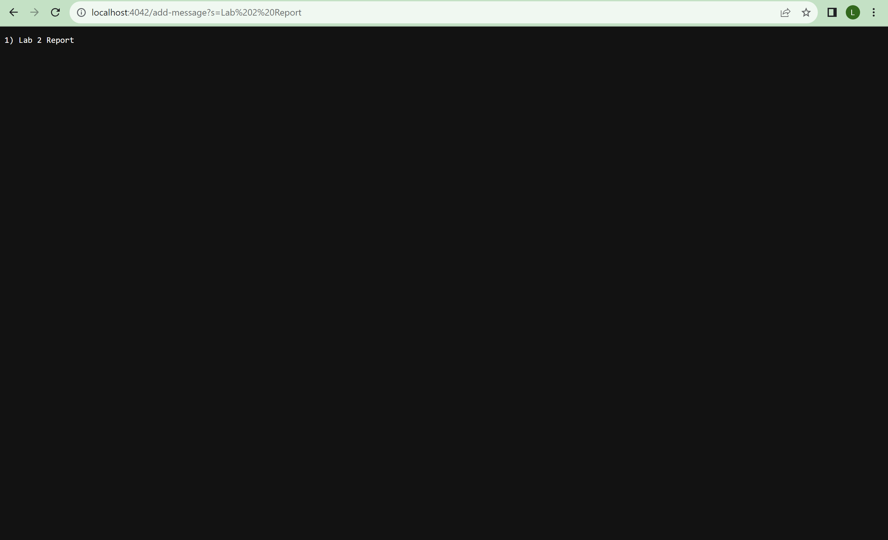
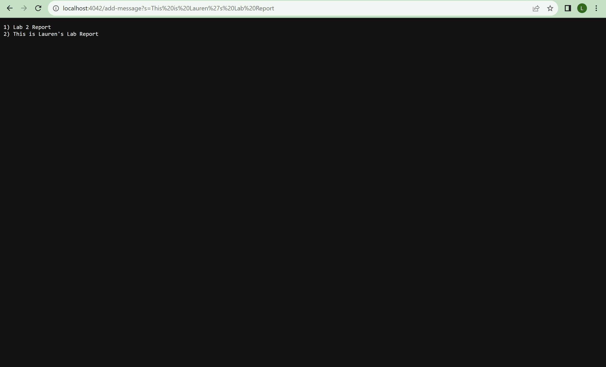
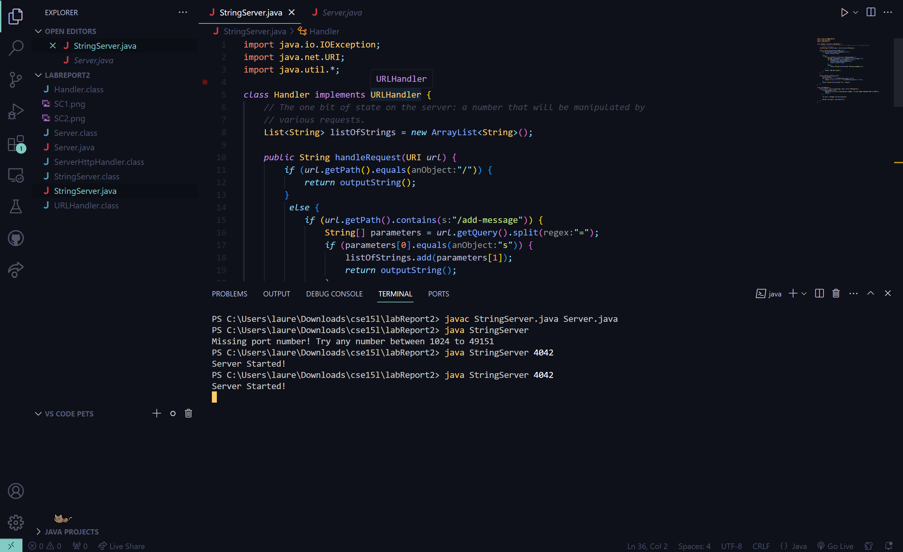
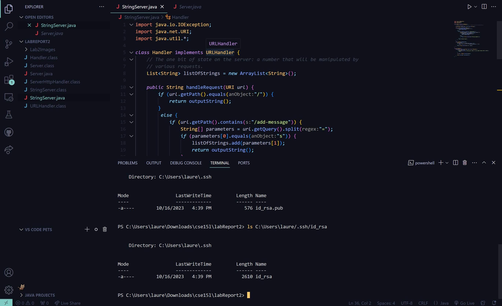
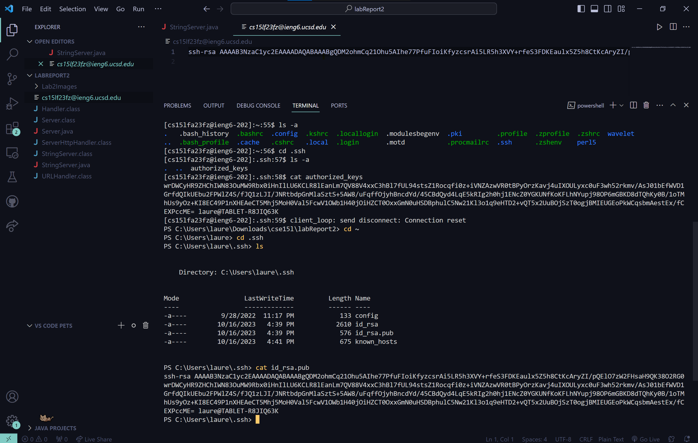
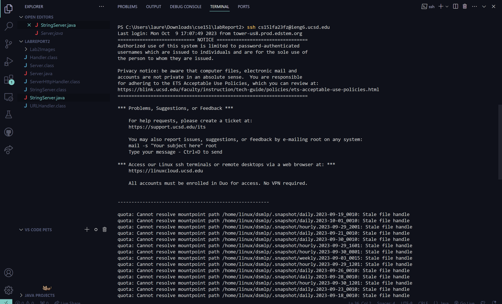

# Lab 2
## Lauren Gager
---

## Part 1

`StringServer` is a server that will start fresh every time the server to started. The String list is empty, and when any user types in `/add-message?s=<New String>`, that string will be added to the list.

**Screenshot 1**
Url Suffix: `/add-message?s=Lab 2 Report`
- The methods that were called would be `handleRequest` and `outputString`. `handleRequest` checks that we want to add a string to the list by `add-message`, then checks that we used `s` before the `=`, then will add the string that comes after. `outputString` cleanly reads from the list of strings we have and outputs them into a list-like format.
- The relevant arguments to those methods would be our URI url, which allows us to handle the url in the first place. And the list we created to store the strings in the first place `List<String> listOfStrings`.
- `listOfStrings` add a new string to the list from the request, which in this case is "Lab 2 Report".

**Screenshot 2**
Url Suffix: `/add-message?s=This is Lauren's Lab Report`
- The methods that were called would be `handleRequest` and `outputString`. `handleRequest` checks that we want to add a string to the list by `add-message`, then checks that we used `s` before the `=`, then will add the string that comes after. `outputString` cleanly reads from the list of strings we have and outputs them into a list-like format.
- The relevant arguments to those methods would be our URI url, which allows us to handle the url in the first place. And the list we created to store the strings in the first place `List<String> listOfStrings`.
- `listOfStrings` add a new string to the list from the request, which in this case is "This is Lauren's Lab Report".

---

## Part 2

---

## Part 3

Something that I learned is how to make connecting to an ssh easier and less tedious. I figured there had to be a way, but luckily this lab broke it down to digestible pieces.
In Lab 2, I actually learned how websites worked better. I genuinely did not know how queries and the likes worked. I feel more confident in how they work. And the fact that I can host a server locally instead of having to pay for a domain.
