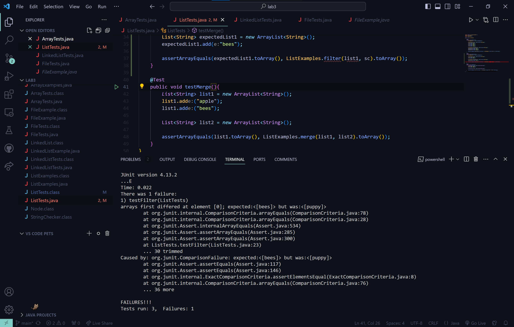

# Lab 3
## Lauren Gager
---

## Part 1

One bug in lab 4 was in `ListExamples.java`, where the new list of words that meet StringChecker's expectations would be returned. But the bug happened where the first index of the list would constantly be replaced rather than being added to the end of the list.

Failure-inducing test:
```
  @Test
    public void testFilter(){
        StringChecker sc = new ListExamples();

        List<String> list1 = new ArrayList<String>();
        list1.add("bee");
        list1.add("bees");
        list1.add("baby");
        list1.add("dog");
        list1.add("puppy");

        List<String> expectedList1 = new ArrayList<String>();
        expectedList1.add("bees");
        expectedList1.add("baby");
        expectedList1.add("puppy");

        assertArrayEquals(expectedList1.toArray(), ListExamples.filter(list1, sc).toArray());
    }
```

Non-Failure-inducing test:
```
  @Test
    public void testFilter1(){
        StringChecker sc = new ListExamples();

        List<String> list1 = new ArrayList<String>();
        list1.add("bee");
        list1.add("bees");

        List<String> expectedList1 = new ArrayList<String>();
        expectedList1.add("bees");

        assertArrayEquals(expectedList1.toArray(), ListExamples.filter(list1, sc).toArray());
    }
```



Code before fixing bug:
```
import java.util.ArrayList;
import java.util.List;

interface StringChecker { boolean checkString(String s); }

class ListExamples implements StringChecker{

  public boolean checkString(String s){
    return (s.length() > 3);
  }


  // Returns a new list that has all the elements of the input list for which
  // the StringChecker returns true, and not the elements that return false, in
  // the same order they appeared in the input list;
  static List<String> filter(List<String> list, StringChecker sc) {
    List<String> result = new ArrayList<>();
    for(String s: list) {
      if(sc.checkString(s)) {
        result.add(0, s);
      }
    }
    return result;
  }


  // Takes two sorted list of strings (so "a" appears before "b" and so on),
  // and return a new list that has all the strings in both list in sorted order.
  static List<String> merge(List<String> list1, List<String> list2) {
    List<String> result = new ArrayList<>();
    int index1 = 0, index2 = 0;
    while(index1 < list1.size() && index2 < list2.size()) {
      if(list1.get(index1).compareTo(list2.get(index2)) < 0) {
        result.add(list1.get(index1));
        index1 += 1;
      }
      else {
        result.add(list2.get(index2));
        index2 += 1;
      }
    }
    while(index1 < list1.size()) {
      result.add(list1.get(index1));
      index1 += 1;
    }
    while(index2 < list2.size()) {
      result.add(list2.get(index2));
      index1 += 1;
    }
    return result;
  }


}
```

Code after fixing bug:
```
import java.util.ArrayList;
import java.util.List;

interface StringChecker { boolean checkString(String s); }

class ListExamples implements StringChecker{

  public boolean checkString(String s){
    return (s.length() > 3);
  }


  // Returns a new list that has all the elements of the input list for which
  // the StringChecker returns true, and not the elements that return false, in
  // the same order they appeared in the input list;
  static List<String> filter(List<String> list, StringChecker sc) {
    List<String> result = new ArrayList<>();
    for(String s: list) {
      if(sc.checkString(s)) {
        result.add(s);
      }
    }
    return result;
  }


  // Takes two sorted list of strings (so "a" appears before "b" and so on),
  // and return a new list that has all the strings in both list in sorted order.
  static List<String> merge(List<String> list1, List<String> list2) {
    List<String> result = new ArrayList<>();
    int index1 = 0, index2 = 0;
    while(index1 < list1.size() && index2 < list2.size()) {
      if(list1.get(index1).compareTo(list2.get(index2)) < 0) {
        result.add(list1.get(index1));
        index1 += 1;
      }
      else {
        result.add(list2.get(index2));
        index2 += 1;
      }
    }
    while(index1 < list1.size()) {
      result.add(list1.get(index1));
      index1 += 1;
    }
    while(index2 < list2.size()) {
      result.add(list2.get(index2));
      index1 += 1;
    }
    return result;
  }


}
```

This fixes the bug because the symptoms we were seeing were that the last string that met the conditions were in the first-index. So upon observing the code, we see that we are adding to the first index rather than simply adding to the list. After changing that line of code, every word that met `StringChecker`'s condition were added to the list as intended.

---

## Part 2

`find`

`-empty` option
```
laure@TABLET-R8JIQ63K MINGW32 ~/downloads/cse15l/lab4/docsearch (main)
$ find technical -empty

laure@TABLET-R8JIQ63K MINGW32 ~/downloads/cse15l/lab4/docsearch (main)
$
```

```
laure@TABLET-R8JIQ63K MINGW32 ~/downloads/cse15l/lab4/docsearch (main)
$ # upon adding a text file that is empty called 'mt.txt'

laure@TABLET-R8JIQ63K MINGW32 ~/downloads/cse15l/lab4/docsearch (main)
$ find technical -empty
technical/mt.txt
```
`empty` would be useful in cases where we made a bunch of files to code, but forgot to fill in contents for said files in order to get the program to work. While it seems somewhat niche, it could be useful to see if a file actually has contents or not. `-empty` essentially looks for an empty file and directories.

`-name` option
```
laure@TABLET-R8JIQ63K MINGW32 ~/downloads/cse15l/lab4/docsearch (main)
$ find technical -name "chapter-1.txt"
technical/911report/chapter-1.txt
```

```
laure@TABLET-R8JIQ63K MINGW32 ~/downloads/cse15l/lab4/docsearch (main)
$ find ./technical/911report -name "chapter*.txt"
./technical/911report/chapter-1.txt
./technical/911report/chapter-10.txt
./technical/911report/chapter-11.txt
./technical/911report/chapter-12.txt
./technical/911report/chapter-13.1.txt
./technical/911report/chapter-13.2.txt
./technical/911report/chapter-13.3.txt
./technical/911report/chapter-13.4.txt
./technical/911report/chapter-13.5.txt
./technical/911report/chapter-2.txt
./technical/911report/chapter-3.txt
./technical/911report/chapter-5.txt
./technical/911report/chapter-6.txt
./technical/911report/chapter-7.txt
./technical/911report/chapter-8.txt
./technical/911report/chapter-9.txt
```
`-name` would be useful in order to find the path to a file you know the name of (just forgot the path), and to somewhat filter out files by their names. In the first example I provide, I am searching through `technical` for `chapter-1.txt`. In the second example, I am searching for all `chapter*.txt` files so I don't have to read the preface in `911report`. What `-name` essentially does is look for files with that name, and since I used *, it will look for anything matching it.

`-type` option
```
laure@TABLET-R8JIQ63K MINGW32 ~/downloads/cse15l/lab4/docsearch (main)
$ find technical -type d
technical
technical/911report
technical/biomed
technical/government
technical/government/About_LSC
technical/government/Alcohol_Problems
technical/government/Env_Prot_Agen
technical/government/Gen_Account_Office
technical/government/Media
technical/government/Post_Rate_Comm
technical/plos
```

```
laure@TABLET-R8JIQ63K MINGW32 ~/downloads/cse15l/lab4/docsearch (main)
$ find technical/911report -type f
technical/911report/chapter-1.txt
technical/911report/chapter-10.txt
technical/911report/chapter-11.txt
technical/911report/chapter-12.txt
technical/911report/chapter-13.1.txt
technical/911report/chapter-13.2.txt
technical/911report/chapter-13.3.txt
technical/911report/chapter-13.4.txt
technical/911report/chapter-13.5.txt
technical/911report/chapter-2.txt
technical/911report/chapter-3.txt
technical/911report/chapter-5.txt
technical/911report/chapter-6.txt
technical/911report/chapter-7.txt
technical/911report/chapter-8.txt
technical/911report/chapter-9.txt
technical/911report/preface.txt
```
`-type` would be useful to find specific files following whatever type you are looking for. Such as how I wanted to find the directories in `technical`, or if I wanted to see all the plain files in `technical/911report`. What `-type` is doing is finding all the paths to whatever type I am looking for. So for `d`, I am looking for directories, and for `f`, I am looking for plain files.

Links:
- https://www.geeksforgeeks.org/find-command-in-linux-with-examples/
- 
