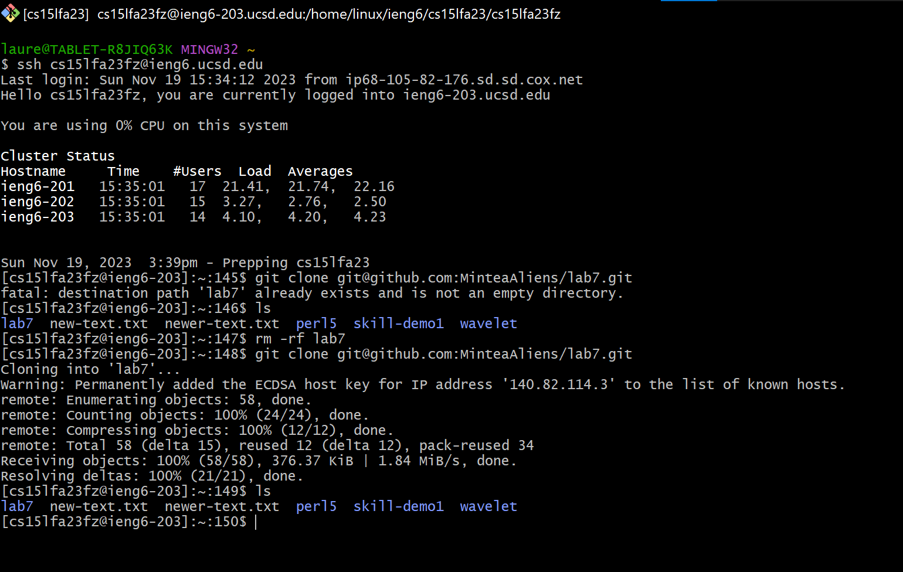

# Lab 4
## Lauren Gager
---

## Step 4
Log into ieng6

I typed `ssh cs15lfa23fz@ieng6.ucsd.edu` in order to log into the ieng6 remote server. Since I had made a key, I did not have to enter in my password.

## Step 5
Clone your fork of the repository from your Github account (using the SSH URL)

First I deleted the existing copy (this was supposed to be done prior, but during this run I forgot). So if we pretend that I did that beforehand, the command I did for this step was `git clone git@github.com:MinteaAliens/lab7.git` in order to be able to commit and push.

## Step 6
Run the tests, demonstrating that they fail

`test.sh` already compiles and runs the required java scripts for us, so we do not have to worry about compiling. So I simply typed `bash test.sh` in order to run the tests.

## Step 7
Edit the code file to fix the failing test

First I type `vim ListExamples.java` in order to edit it within the terminal. I then use `:44` in order to jump to line 44 where the bug is. Then I press `e` to get to the end of the word (in this case, the word I want to get to the end of is `index1` since it should be `index2`. I then type `x` to delete the 1. I then press `i` to enter insert mode. Then I press `2` in order to place a 2 where the 1 once was. Then I press `<escape>` to enter back into normal mode. And in order to save and exit vim, I typed `:wq`. The screenshots show what I saw in vim before typing `:wq` and then after typing `:wq`, which kicked me back into the terminal.

## Step 8
Run the tests, demonstrating that they now succeed

Once again, I type `bash test.sh` and we see now that all tests pass.

## Step 9
Commit and push the resulting change to your Github account (you can pick any commit message!)

We edited only one file. That file being `ListExamples.java`, so we need to add that to the stage so we can commit and push. In order to do that, I used the command `git add ListExamples.java`, which adds that file to the stage. Now that is is staged, I can commit. `git commit -m "Fixed ListExamples.java"` gives a clear message of what I did and now the stage is set to push. I can now push my changes to the repo using the command `git push`. 
