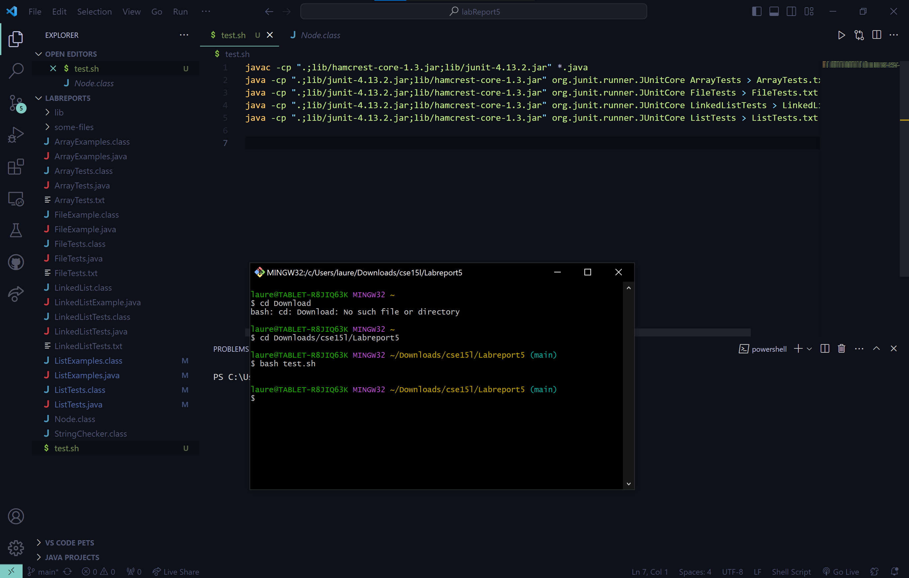
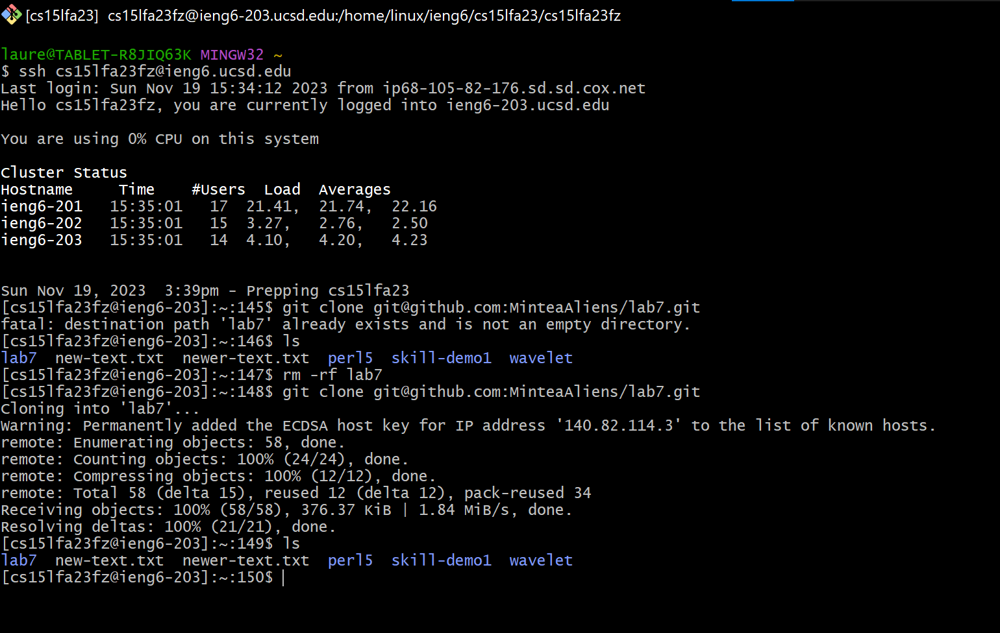

# Lab 5
## Lauren Gager
---

## Part 1: Debugging Scenario

**Student Jane:**

I just finished lab3 and I was getting tired of typing everything all the time... so I made a bash script! I have it compile everything and then run the tests one by one, but for some reason I am stuck in an infinite loop I think? It won't finish the bash script and gets stuck somewhere, but despite looking everywhere through my code I can't find anything that would make it loop like this. I'm genuinely confused and I think I might be missing the problem because there are so many files that I wrote tests for and so many lines of code.

**TA:**
This is why we recommend you write your code incrementally. When you write too much code and decide to test it at the end, it makes it harder to check for bugs. For now, I recommend using echo statements to try to figure out where exactly in your bash script it has trouble running. After that, you can observe the behavior from there. Recall jdb and don't be afraid to comment out lines of code or add lines of code to try to figure out what is the problem! If your tests aren't helping, try to make more tests based on what you observe. Just make sure to remove those changes (if they weren't necessary) when you are done! I'm sorry this is a vague answer, but I hope this pushes you towards the right directon. If you are still having trouble after that, please feel free to respond to the thread.

*What fixed the bug*

**Student Jane**:

I definitely learned my lesson about incremental coding. I put echo statements after each run statement in my bash script and found out it was my LinkedListExamples and LinkedListTest that was giving problems. I then commented out the entirety of my LinkedListTest and saw that it would run. So I incrementally readded each test until I got the same symptom I experienced earlier. I saw that it was my toString() portion. But I couldn't figure out what... so I added another toString() test for an empty list and that worked. The only difference between that empty list toString() test and the test I had previously was that the original had append. Turns out, my append() function was buggy! Thank you for the help!

```
lib/
  hamcrest-core-1.3.jar
  junit-4.13.2.jar
ArrayExamples.java
ArrayTests.java
FileExample.java
FileTests.java
LinkedListExample.java
LinkedListTests.java
ListExample.java
listTests.java
test.sh
```

**LinkedListTests.java before fix**
```
import static org.junit.Assert.*;
import org.junit.*;

public class LinkedListTests{

    @Test
    public void EmptyTest1(){
        // test that the first node in an empty list returns null
        LinkedList newList = new LinkedList();
        assertEquals(null, newList.first());
        System.out.println("EmptyTest1 done");
    }
    
    @Test
    public void EmptyTest2(){
        // test that the last node in an empty list returns null
        LinkedList newList = new LinkedList();
        assertEquals(null, newList.last());
        System.out.println("EmptyTest2 done");
    }

    @Test
    public void AppendTest(){
        // test appending
        LinkedList newList = new LinkedList();
        newList.append(1);
        assertEquals(1, newList.first());
        assertEquals(1, newList.last());
        System.out.println("AppendTest done");
    }


    @Test
    public void PrependTest(){
        // test prepending
        LinkedList newList = new LinkedList();
        newList.append(1);
        newList.prepend(3);
        assertEquals(3, newList.first());
        assertEquals(1, newList.last());
        System.out.println("PrependTest done");
    }

    @Test
    public void StringTest(){
        // test toString()
        LinkedList newList = new LinkedList();
        newList.append(1);
        newList.append(2);
        newList.append(3);

        assertEquals("1 2 3", newList.toString());
        System.out.println("StringTest done");
    }

    @Test
    public void LengthTest1(){
        // test length with empty list
        LinkedList newList = new LinkedList();
        
        assertEquals(0, newList.length());
        System.out.println("LengthTest1 done");
    }

    @Test
    public void LengthTest2(){
        // test length with a populated list
        LinkedList newList = new LinkedList();
        newList.append(1);
        newList.append(2);
        newList.append(3);

        assertEquals(3, newList.length());
        System.out.println("LengthTest2 done");
    }

}
```

**test.sh before fix**
```
javac -cp ".;lib/hamcrest-core-1.3.jar;lib/junit-4.13.2.jar" *.java
java -cp ".;lib/junit-4.13.2.jar;lib/hamcrest-core-1.3.jar" org.junit.runner.JUnitCore ArrayTests > ArrayTests.txt
java -cp ".;lib/junit-4.13.2.jar;lib/hamcrest-core-1.3.jar" org.junit.runner.JUnitCore FileTests > FileTests.txt
java -cp ".;lib/junit-4.13.2.jar;lib/hamcrest-core-1.3.jar" org.junit.runner.JUnitCore LinkedListTests > LinkedListTests.txt
java -cp ".;lib/junit-4.13.2.jar;lib/hamcrest-core-1.3.jar" org.junit.runner.JUnitCore ListTests > ListTests.txt
```

**LinkedListExample.java before fix**
```

import java.util.NoSuchElementException;

class Node {
    int value;
    Node next;
    public Node(int value, Node next) {
        this.value = value;
        this.next = next;
    }
}
class LinkedList {
    Node root;
    public LinkedList() {
        this.root = null;
    }
    /**
     * Adds the value to the _beginning_ of the list
     * @param value
     */
    public void prepend(int value) {
        // Just add at the beginning
        this.root = new Node(value, this.root);
    }
    /**
     * Adds the value to the _end_ of the list
     * @param value
     */
    public void append(int value) {
        if(this.root == null) {
            this.root = new Node(value, null);
            return;
        }
        // If it's just one element, add if after that one
        Node n = this.root;
        if(n.next == null) {
            n.next = new Node(value, null);
            return;
        }
        // Otherwise, loop until the end and add at the end with a null
        while(n.next != null) {
            n = n.next;
            n.next = new Node(value, null);
        }
    }
    /**
     * @return the value of the first element in the list
     */
    public int first() {
        return this.root.value;
    }
    /**
     * @return the value of the last element in the list
     */
    public int last() {
        Node n = this.root;
        // If no such element, throw an exception
        if(n == null) { throw new NoSuchElementException(); }
        // If it's just one element, return its value
        if(n.next == null) { return n.value; }
        // Otherwise, search for the end of the list and return the last value
        while(n.next != null) {
            n = n.next;
        }
        return n.value;
    }
    /**
     * @return a string representation of the list
     */
    public String toString() {
        Node n = this.root;
        String s = "";
        while(n != null) {
            s += n.value + " ";
            n = n.next;
        }
        return s;
    }
    /**
     * @return the number of elements in the list
     */
    public int length() {
        Node n = this.root;
        int i = 0;
        while(n != null) {
            i += 1;
            n = n.next;
        }
        return i;
    }
}
```

```
javac -cp ".;lib/hamcrest-core-1.3.jar;lib/junit-4.13.2.jar" *.java
java -cp ".;lib/junit-4.13.2.jar;lib/hamcrest-core-1.3.jar" org.junit.runner.JUnitCore TwoSumsTest
```

**LinkedListTests.java after fix**
```
import static org.junit.Assert.*;
import org.junit.*;

public class LinkedListTests{

    @Test
    public void EmptyTest1(){
        // test that the first node in an empty list returns null
        LinkedList newList = new LinkedList();
        assertEquals(null, newList.first());
        System.out.println("EmptyTest1 done");
    }
    
    @Test
    public void EmptyTest2(){
        // test that the last node in an empty list returns null
        LinkedList newList = new LinkedList();
        assertEquals(null, newList.last());
        System.out.println("EmptyTest2 done");
    }

    @Test
    public void AppendTest(){
        // test appending
        LinkedList newList = new LinkedList();
        newList.append(1);
        assertEquals(1, newList.first());
        assertEquals(1, newList.last());
        System.out.println("AppendTest done");
    }


    @Test
    public void PrependTest(){
        // test prepending
        LinkedList newList = new LinkedList();
        newList.append(1);
        newList.prepend(3);
        assertEquals(3, newList.first());
        assertEquals(1, newList.last());
        System.out.println("PrependTest done");
    }

    @Test
    public void StringTest1(){
        // test toString()
        LinkedList newList = new LinkedList();

        assertEquals("", newList.toString());
        System.out.println("StringTest done");
    }

    @Test
    public void StringTest2(){
        // test toString()
        LinkedList newList = new LinkedList();
        newList.append(1);
        newList.append(2);
        newList.append(3);

        assertEquals("1 2 3", newList.toString());
        System.out.println("StringTest done");
    }

    @Test
    public void LengthTest1(){
        // test length with empty list
        LinkedList newList = new LinkedList();
        
        assertEquals(0, newList.length());
        System.out.println("LengthTest1 done");
    }

    @Test
    public void LengthTest2(){
        // test length with a populated list
        LinkedList newList = new LinkedList();
        newList.append(1);
        newList.append(2);
        newList.append(3);

        assertEquals(3, newList.length());
        System.out.println("LengthTest2 done");
    }

}
```

**LinkedListExamples.java append() after fix**
```
  public void append(int value) {
        if(this.root == null) {
            this.root = new Node(value, null);
            return;
        }
        // If it's just one element, add if after that one
        Node n = this.root;
        if(n.next == null) {
            n.next = new Node(value, null);
            return;
        }
        // Otherwise, loop until the end and add at the end with a null
        while(n.next != null) {
            n = n.next;
        }
        n.next = new Node(value, null);
    }
```

**test.sh after fix**
```
javac -cp ".;lib/hamcrest-core-1.3.jar;lib/junit-4.13.2.jar" *.java
java -cp ".;lib/junit-4.13.2.jar;lib/hamcrest-core-1.3.jar" org.junit.runner.JUnitCore ArrayTests > ArrayTests.txt
echo "Tests ran for ArrayTests"
java -cp ".;lib/junit-4.13.2.jar;lib/hamcrest-core-1.3.jar" org.junit.runner.JUnitCore FileTests > FileTests.txt
echo "Tests ran for FileTests"
java -cp ".;lib/junit-4.13.2.jar;lib/hamcrest-core-1.3.jar" org.junit.runner.JUnitCore LinkedListTests > LinkedListTests.txt
echo "Tests ran for LinkedListTest"
java -cp ".;lib/junit-4.13.2.jar;lib/hamcrest-core-1.3.jar" org.junit.runner.JUnitCore ListTests > ListTests.txt
echo "Tests ran for ListTests"
```

---

## Part 2: Reflection

I learned a lot about how websites and remote servers work, how to create a bash script (and what a bash script is even used for), and much more. I think I will actually end up using bash scripts in the future so I can speed up the testing process. I want to implement tests and bash scripts in my personal projects to help relieve the ehadache of running everything and the debugging process. I don't use java often, but if I do, jdb seems useful to check the content of my variables.
